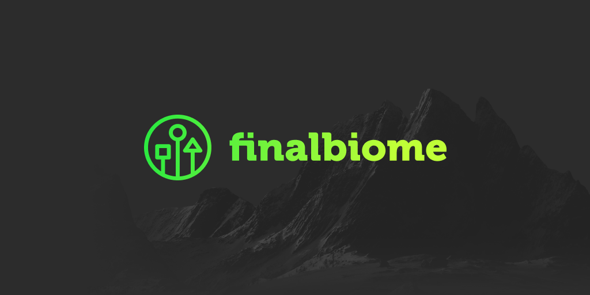

# finalbiome

## FinalBiome is a decentralized game deployment platform

We aim at delivering a simple and frictionless blockchain experience for developers and gamers.

**Game developers** will benefit from easy no-code access to blockchain technology, traditional business and monetization models, and the possibility to deploy any existing game without hiring new team members.

**For the gamers**, we provide an easy and conventional game onboarding, no hidden commissions, in-game assets prices free from cryptomarket volatility, and clear and understandable game logic written on-chain. 

**All our users** will enjoy a stablecoin, blockchain security, cross-game marketplace, and no transaction fees.

**FinalBiome** – deploying a game on the blockchain has never been so easy.

Check it out [finalbiome.net](https://finalbiome.net)
